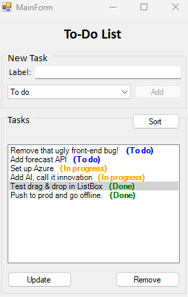

# To-Do List WinForms App

A simple and interactive To-Do List application built with C# and WinForms.
This app allows users to add, update, remove, drag & drop, and sort tasks with different statuses.
Friendly for designers thanks to a JSON file that allows quick changes to displayed colors and status names.

## Features

 - Add, Remove & Update Tasks,
 - Set tasks as To Do, In Progress, or Done,
 - Custom Drag & Drop – Change the order of tasks by dragging them,
 - Sorting – Sort tasks status,
 - Color-Coded Statuses,
 - Custom ListBox Drawing,
 - Task Persistence – Tasks are stored in a JSON file.

## Tech stack

- **C# .NET WinForms**,
- **JSON (Newtonsoft.Json)**.

 
 

  

